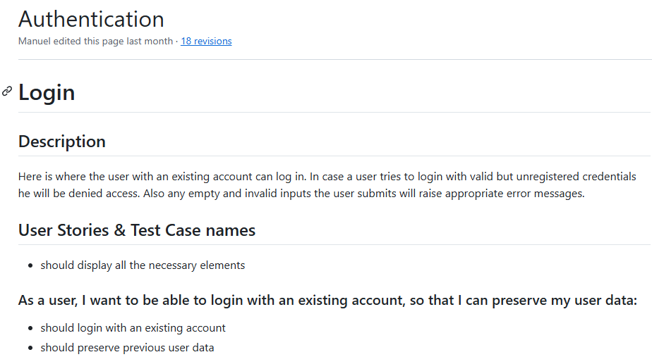

# QA Engineer Showcase: Automation Practice

## Description:

This project aims to showcase the process used to test the website _Automation Practice_, including the creation of all the corresponding test documentation, such as wikis, describing each of the modules of functionality that make up the application, the user stories outlining such funcitonality, and the test cases derived from them.

The high priority test cases have also been translated into test scripts and automated. This project implements all such tests scripts using the Cypress testing framework.

The tests include functional and e2e tests. As well as different test types such as accessibility, performance and visual tests.

_Note:_ The [Automation Practice](http://www.automationpractice.pl/) website is a full-fledged website built for QA and test automation practice purposes.

## Testing Process:

In order to do a thorough testing of the functionality present in the Automation Practice website these steps have been taken:

1. Create an account on the application
2. Do exploratory testing / use the application as an user would
3. Divide the app into different buckets of functionality
4. Prioritize buckets of functionality depending on risk
5. Create a wiki section for each of the buckets of functionality
6. On each wiki section add a description and user stories outlining all the corresponding functionality
7. Create test cases for each of the user stories
8. Create detailed test cases in a spreadsheet
9. Create automated test scripts from detailed test cases (only high prio)

### 1. Create an account on the application: ✅

### 2. Do exploratory testing / use the application as an user would: ✅

### 3. Divide the app into different buckets of functionality: ✅

#### The following buckets of functionality have been indentified:

- Main Page
- Authentication
- My Account
- Contact Us
- Search
- Catalogue
- Shopping Cart
- Product Detail Page(PDP)
- Checkout
- Subscribe
- Footer

### 4. Prioritize buckets of functionality depening on risk: ✅

_High prio_

- Checkout
- Shopping Cart
- Product Detail Page(PDP)
- Authentication
- Catalogue
- Search

_Low prio_

- My Account
- Contact Us
- Subscribe
- Main Page
- Footer

### 5. Create a wiki section for each of the buckets of functionality: ✅

Each bucket of functionality will have it's own wiki section in this repostitory.

### 6. On each wiki section add a description and user stories outlining all the corresponding functionality: ✅

Each wiki section will be made of a description where the specific functionality is described, followed by user stories related to such functionality.

The user stories in turn are composed of at least as many test cases derived from them.

In the wiki lists these test case names can be found beneath the user story they belong to.

Example: [Authentication wiki](https://github.com/manuel12/automation-practice/wiki/Authentication)

Each test case name will represent a full _test case in a spreadsheet_ (complete with test data, test steps and expected and actual resutls, etc) and a _test script in a test suite_ (complete with test data, automated test steps and test assertions).

So going from each bucket of functionality down to the user stories and then the test cases derived from them can be visualized the following way:

- Bucket of functionality:

  - User Stories:

    - Test cases (spreadsheet):

      - Test data
      - Test steps
      - Expected and actual results

    - Test scripts (code):
      - Test data
      - Automated test steps
      - Automated test assertions

You can click on the links below. Each bucket of functionality will link to their own wiki page, where their description, user stories and test case names are displayed. At the bottom of each wiki page there are links to both the spreadsheet test cases and the test scripts representing them.

_High Prio Buckets of Functionality_

- [Checkout](https://github.com/manuel12/automation-practice/wiki/Checkout):

  - [Shopping Cart](https://github.com/manuel12/automation-practice/wiki/Checkout#checkout---shopping-cart-summary)
  - [Sign In](https://github.com/manuel12/automation-practice/wiki/Checkout#checkout---sign-in)
  - [Address](https://github.com/manuel12/automation-practice/wiki/Checkout#checkout---address)
  - [Shipping](https://github.com/manuel12/automation-practice/wiki/Checkout#checkout---shipping)
  - [Payment](https://github.com/manuel12/automation-practice/wiki/Checkout#checkout---payment)

- [Shopping Cart](https://github.com/manuel12/automation-practice/wiki/Shopping-Cart)

- [Product Detail Page](<https://github.com/manuel12/automation-practice/wiki/Product-Detail-Page-(PDP)>)

- [Authentication](https://github.com/manuel12/automation-practice/wiki/Authentication)

- [Catalogue](https://github.com/manuel12/automation-practice/wiki/Catalogue)

- [Search](https://github.com/manuel12/automation-practice/wiki/Search)

_Low Prio Buckets of Functionality_

- [My Account](https://github.com/manuel12/automation-practice/wiki/-Account)

- [Contact Us](https://github.com/manuel12/automation-practice/wiki/Contact-Us)

- [Subscribe](https://github.com/manuel12/automation-practice/wiki/Subscribe)

- [Main Page](https://github.com/manuel12/automation-practice/wiki/Main-Page)

- [Footer](https://github.com/manuel12/automation-practice/wiki/Footer)

## Features:

- Equivalence partitioning tests
- Boundary value analysis tests
- UI functional tests
- Accessibility tests (pending)
- Responsiveness tests (pending)
- Visual tests (pending)

## Uses

- Cypress
