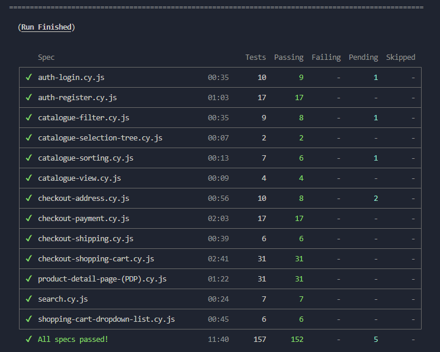

# QA Engineer Skill Showcase: Automation Practice

## Description:

This project aims to showcase the process used to test the website _Automation Practice_, including the creation of all the corresponding test documentation, such as wikis used to describe each of the modules of functionality that make up the application, the user stories outlining such functionality, and the test cases derived from them.

The high priority test cases have also been translated into test scripts and automated. This project implements all such test scripts using the [Cypress](http://www.cypress.io/) testing framework.

The tests include smoke, functional and e2e tests. As well as different test types such as accessibility, performance and visual tests.

_Note:_ The [Automation Practice](http://www.automationpractice.pl/) website is a full-fledged website built for QA and test automation practice purposes.

## Testing Process:

In order to do a thorough testing of the functionality present in the Automation Practice website these steps have been taken:

1. Create an account on the application
2. Do exploratory testing / use the application as an user would
3. Divide the app into different buckets of functionality
4. Prioritize buckets of functionality depending on risk
5. Create a wiki section for each of the buckets of functionality
6. On each wiki section add a description and user stories outlining all the corresponding functionality
7. Create smoke test suite of the most basic functionality
8. Create e2e test suite of common end-to-end user flows
9. Create test cases for each of the user stories
10. Create detailed test cases in a spreadsheet
11. Create automated test scripts from detailed test cases (only high prio)

I will now take you step by step and show you how each step has been taken.

### 1. Create an account on the application: ✅

Test account credentials:

- username: testuser@gmail.com
- password: Testpass1!

### 2. Do exploratory testing / use the application as an user would: ✅

Already performed exploratory testing with said account and familiarized myself with the site.

### 3. Divide the app into different buckets of functionality: ✅

#### The following buckets of functionality have been identified:

- Main Page
- Authentication
- My Account
- Contact Us
- Search
- Catalogue
- Shopping Cart
- Product Detail Page
- Checkout
- Subscribe
- Footer

### 4. Prioritize buckets of functionality depending on risk: ✅

_High prio_

- Checkout
- Shopping Cart
- Product Detail Page
- Authentication
- Catalogue
- Search

_Low prio_

- My Account
- Contact Us
- Subscribe
- Main Page
- Footer

### 5. Create a wiki section for each of the buckets of functionality: ✅

Each bucket of functionality has its own wiki section in this repository, where their description, user stories and test case names are displayed.

Note: It's important to mention that since there are no available requirement documents outlining the functionality of this site I will create user stories and test cases based on the obvious and intuitive functionality and also based on the functionality of similar e-commerce shops.

Things like register and login functionality should work as expected. Things like catalogue and shopping cart will also be assume to work as they do on other sites. Also for example, any existing UI will be assumed to have a functionality, if "filter" input elements exist on the catalogue then filter functionality will be assumed to be expected, if sort buttons exist on the catalogue, then sort functionality will be expected, and so on. All of the UI present will be assumed to function intuitively as it would work on a similar e-commerce shop, like [amazon.com](http://www.amazon.com/), and will have corresponding user stories and test cases outlining it's functionality.

At the bottom of each wiki page there are links to both the spreadsheet test cases and the test scripts belonging to them:

_High Prio Buckets of Functionality_

- Checkout:

  - [Shopping Cart](https://github.com/manuel12/automation-practice/wiki/Checkout-%E2%80%90-Shopping-Cart)
  - [Sign In](https://github.com/manuel12/automation-practice/wiki/Checkout-%E2%80%90-Sign-In)
  - [Address](https://github.com/manuel12/automation-practice/wiki/Checkout-%E2%80%90-Address)
  - [Shipping](https://github.com/manuel12/automation-practice/wiki/Checkout-%E2%80%90-Shipping)
  - [Payment](https://github.com/manuel12/automation-practice/wiki/Checkout-%E2%80%90-Payment)

- [Shopping Cart](https://github.com/manuel12/automation-practice/wiki/Shopping-Cart)

- [Product Detail Page](https://github.com/manuel12/automation-practice/wiki/Product-Detail-Page)

- [Authentication](https://github.com/manuel12/automation-practice/wiki/Authentication)

- [Catalogue](https://github.com/manuel12/automation-practice/wiki/Catalogue)

- [Search](https://github.com/manuel12/automation-practice/wiki/Search)

_Low Prio Buckets of Functionality_

- [My Account](https://github.com/manuel12/automation-practice/wiki/My-Account)

- [Contact Us](https://github.com/manuel12/automation-practice/wiki/Contact-Us)

- [Subscribe](https://github.com/manuel12/automation-practice/wiki/Subscribe)

- [Main Page](https://github.com/manuel12/automation-practice/wiki/Main-Page)

- [Footer](https://github.com/manuel12/automation-practice/wiki/Footer)

### 6. On each wiki section add a description and user stories outlining all the corresponding functionality: ✅

Example: [Authentication wiki](https://github.com/manuel12/automation-practice/wiki/Authentication)


As you can see from the above example, in which the wiki for the _Authentication - Login_ module of functionality is displayed, each wiki section is made of a description(displayed below Login heading), followed by user stories and test cases related to such functionality.

The user stories in turn have at least as many test cases derived from them. Test case names can be found beneath the user story they belong to. Some test cases, like the first test case _"should display all necessary elements"_ are standalone and do not belong to any user story.

Each test case name represents a full _test case in a spreadsheet_ (complete with test data, test steps and expected and actual results, etc):


And a _test script in a test suite_ (complete with test data, automated test steps and test assertions):

<!--  -->


Links to both spreadsheets with test cases and test scripts can be found at the bottom of each wiki section as shown here:


So going from each bucket of functionality down to the user stories and then the test cases derived from them can be visualized the following way:

- Bucket of functionality:

  - User Stories:

    - Test cases (spreadsheet):

      - Test data
      - Test steps
      - Expected and actual results

    - Test scripts (code):

      - Test data
      - Automated test steps
      - Automated test assertions

### 7. Create smoke test suite of the most basic functionality:

The first set of test cases created are the smoke test suite. This will test the very basic functionality of the applicaiton like register, login, navigating the site, searching for a product and maybe adding a product to the shopping cart.

### 8. Create e2e test suite of common end-to-end user flows:

The end-to-end test suite will have the most complicated tests of entire project, it will basically mimic entire user flows from registering a user to performing several actions and loggin out. Some examples of user flows that will be included in e2e test suite:

- Register user, login, navigate to catalogue, check all catalogue filters work correctly, check all sorting options work correctly, logout

- Register user, login, search for a product, choose product size, color and quantity, add product to cart, complete checkout flow, check order is correctly reflected in user order history, logout

- Register user, login, search for a product, add product to shopping cart, search for a product, add a second product to shopping cart, search for a product, add a third product to shopping cart, complete checkout flow, check order is correctly reflected in user order history, logout

## How to install Cypress:

For installing cypress cd to the project's root folder and run:

    npm install

## How to run automated tests:

For opening cypress client cd to the project's root folder and run:

    npx cypress open

Or if running from the CLI:

    npx cypress run

Or if running from the CLI use one of the scripts found in package.json:

```
'test:chrome': 'cypress run --browser chrome',
'test:firefox': 'cypress run --browser firefox',
'test:edge': 'cypress run --browser edge',
'test:electron': 'cypress run --browser electron',
'test:all-browsers': 'npm run test:chrome && npm run test:firefox && npm run test:edge && npm run test:electron',
'test:e2e': 'cypress run --spec 'cypress/e2e/e2e/'',
'test:functional': 'cypress run --spec 'cypress/e2e/functional/'',
'test:smoke': 'cypress run --spec 'cypress/e2e/smoke/'',
```

## Tests

| Type       | Location                                               |
| ---------- | ------------------------------------------------------ |
| smoke      | [cypress/tests/smoke/](cypress/tests/smoke/)           |
| e2e        | [cypress/tests/e2e/](cypress/tests/e2e/)               |
| functional | [cypress/tests/functional/](cypress/tests/functional/) |

## Current test report (functional tests):



## Features:

- Black Box tests
- Equivalence partitioning tests
- Boundary value analysis tests
- UI functional tests
- Accessibility tests (pending)
- Responsiveness tests (pending)
- Visual tests (pending)

## Uses

- Cypress
